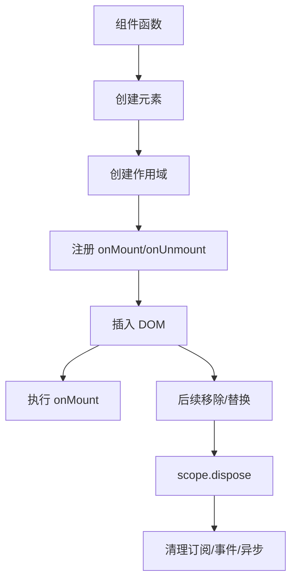
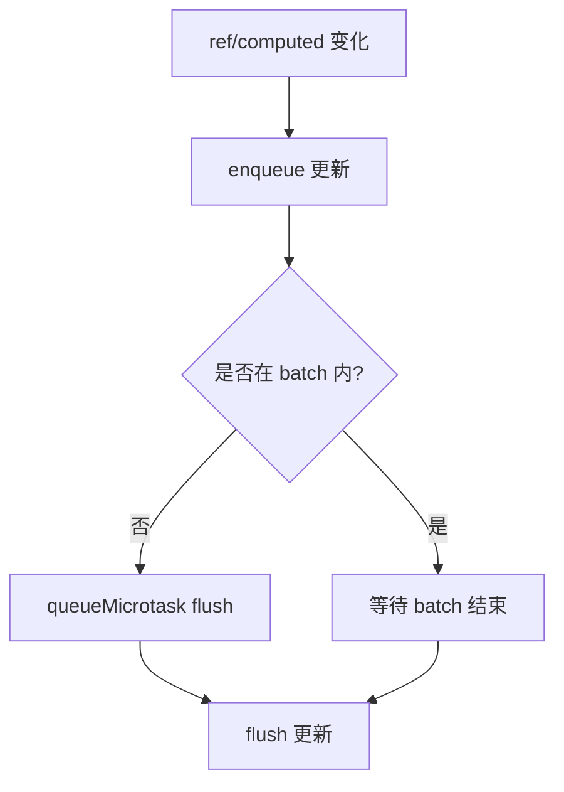

# 图表

## 生命周期作用域流程

```mermaid
flowchart TD
  A[组件函数] --> B[创建元素]
  B --> C[创建作用域]
  C --> D[注册 onMount/onUnmount]
  D --> E[插入 DOM]
  E --> F[执行 onMount]
  E --> G[后续移除/替换]
  G --> H[scope.dispose]
  H --> I[清理订阅/事件/异步]
```

## 调度器流程

```mermaid
flowchart TD
  A[ref/computed 变化] --> B[enqueue 更新]
  B --> C{是否在 batch 内?}
  C -- 否 --> D[queueMicrotask flush]
  C -- 是 --> E[等待 batch 结束]
  D --> F[flush 更新]
  E --> F
```
